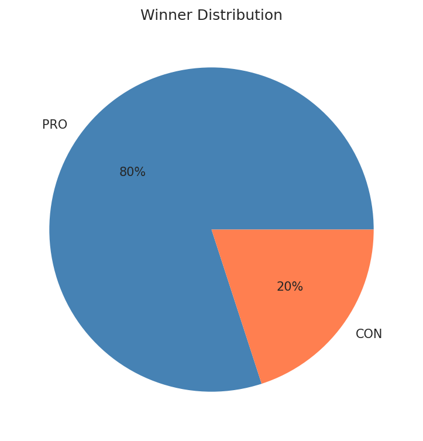
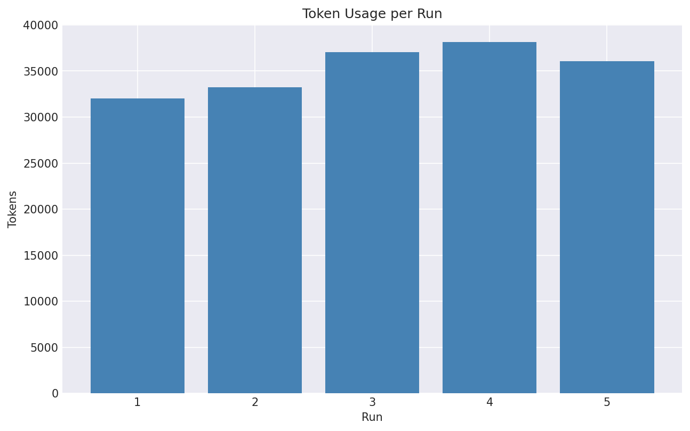
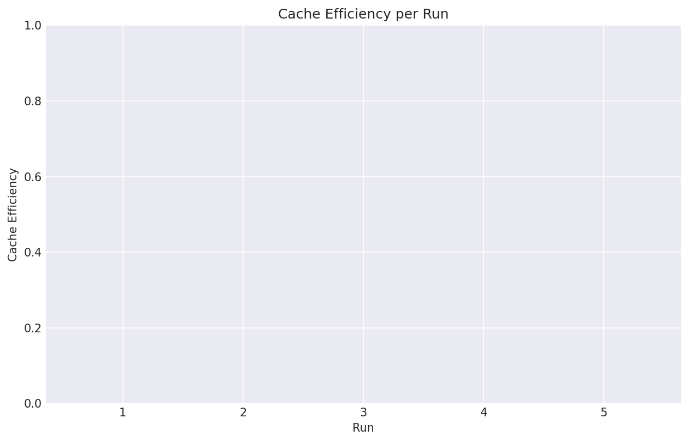
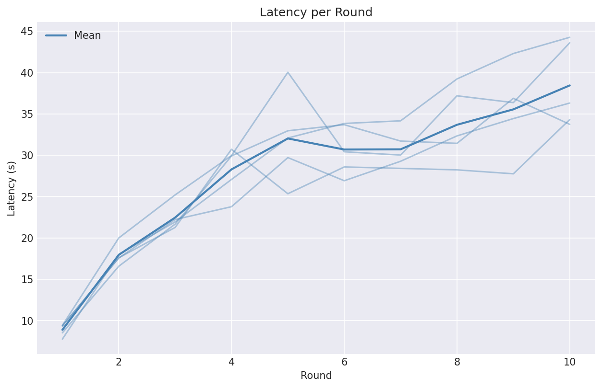
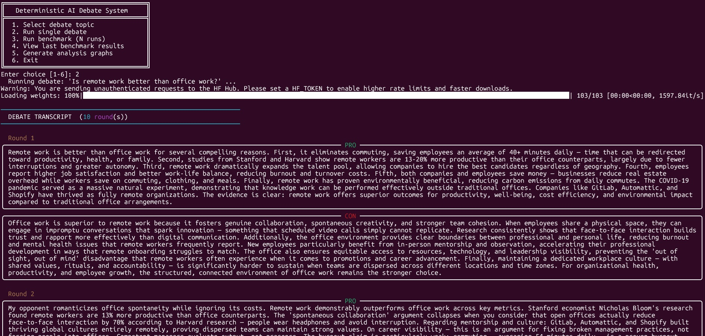

# Deterministic Multi-Agent AI Debate

A research-grade benchmark system that pits two LLM agents (PRO vs. CON) against each other in a structured, **fully deterministic** debate on the question: *"Will AI replace software engineers?"*

Built as a university thesis project. Every verdict is reproducible — no LLM sampling randomness, no floating tiebreakers — making it suitable for controlled empirical evaluation.

---

## Research Overview

Standard LLM-vs-LLM debate pipelines suffer from three failure modes that invalidate empirical comparison:

1. **Non-determinism** — temperature > 0 means repeated runs produce different verdicts with no ground truth.
2. **Topic drift** — agents subtly shift their position mid-debate to score points, undermining stance integrity.
3. **Context explosion** — unbounded ledger growth causes runaway token costs and hits context-window limits.

This system addresses all three through a layered architecture: a **Shared Evidence Registry** for structured retrieval, **Semantic Math** (V₁ anchor + centroid alignment) to enforce stance coherence, and **FinOps Context Truncation** to bound cost per debate.

---

## Architecture

### RAG Shared Evidence Registry

Both agents draw from a shared pool of evidence objects (`EvidenceSchema`), each carrying a `quality_score ∈ [0.0, 1.0]` and a citable `source`. Claims must reference evidence by ID, creating a verifiable citation chain rather than free-form assertion. The Judge's Level 1 tiebreaker uses mean evidence quality, incentivising agents to ground arguments in high-quality sources.

### Semantic Math — V₁ Anchor and Centroid Alignment

Every agent's **first claim embedding** is stored immutably as `v1_embedding` (the V₁ anchor). On every subsequent round, the `SemanticDriftEvaluator` computes two penalties:

- **V₁ Distance penalty** — `max(0, cosine_distance(current, v₁) − threshold)`. Fires when the agent drifts too far from its opening position.
- **Centroid Alignment penalty** — `max(0, cosine_similarity(current, opponent_centroid) − threshold)`. Fires when the agent's current claim aligns suspiciously closely with the opponent's centroid, signalling sycophantic drift.

Opponent embeddings are weighted by a recency-decay factor `λ^(n−1−i)` so that recent claims contribute more to the centroid than older ones.

```
drift_penalty = v1_penalty + centroid_penalty
```

The V₁ anchor is permanently protected: `set_v1_embedding()` raises `RuntimeError` on a second call, making stance lock an enforced invariant rather than a convention.

### FinOps Context Truncation

The ledger passed to each agent is windowed to the last `LEDGER_WINDOW` entries (default: 3). The V₁ anchor is stored separately on the agent and is never part of the window — it survives truncation. This bounds input tokens per round to `O(LEDGER_WINDOW × avg_claim_length)` regardless of how many rounds have elapsed, keeping cost per debate predictable.

### Four-Level Deterministic Tiebreaker

When aggregate responsiveness scores tie, the `Judge` cascades through:

| Level | Criterion | Winner |
|---|---|---|
| 1 | Mean evidence quality score | Higher wins |
| 2 | V₁ faithfulness (cosine distance from anchor) | Lower wins |
| 3 | Mean responsiveness score | Higher wins |
| 4 | PRNG seeded by `SHA-256(debate_id)` | Deterministic coin flip |

`temperature=0` on all LLM calls ensures identical outputs for identical inputs. Level 4 ensures a winner always exists with no human intervention.

---

## Project Structure

```
src/debate/
├── agents/
│   ├── base.py          # BaseAgent ABC — V₁ lock, windowed ledger
│   ├── pro.py           # ProAgent — Anthropic calls, prompt caching
│   └── con.py           # ConAgent — Anthropic calls, prompt caching
├── benchmarks/
│   └── reporter.py      # BenchmarkReporter — JSON export
├── engine/
│   ├── embeddings.py    # EmbeddingService singleton (all-MiniLM-L6-v2)
│   ├── ledger.py        # LedgerManager — windowing, serialization, weights
│   └── pipeline.py      # DebateResult, run_debate(), run_benchmarks()
├── evaluation/
│   ├── judge.py         # Judge — 4-level tiebreaker, verdict
│   ├── responsiveness.py
│   └── semantic_drift.py
├── schemas/
│   ├── claim.py         # EvidenceSchema, ClaimPayloadSchema
│   ├── round.py         # LedgerEntry, RoundSchema
│   └── verdict.py       # VerdictSchema
└── config.py            # Settings (pydantic-settings, .env)
main.py                  # Thin CLI — argparse + run_benchmarks()
```

---

## Installation

**Prerequisites:** Python 3.12+ and [`uv`](https://docs.astral.sh/uv/) must be installed on your system.

```bash
# 1. Clone the repository
git clone <repo-url>
cd Deterministic-AI-Debate

# 2. Install all dependencies (creates .venv automatically)
uv sync

# 3. Copy the environment template and fill in your credentials
cp .env-example .env
```

Open `.env` and set `ANTHROPIC_API_KEY` at minimum. The full reference of supported keys and their defaults is shown below:

```env
ANTHROPIC_API_KEY=sk-ant-...
RECENCY_DECAY_LAMBDA=0.3
V1_DISTANCE_THRESHOLD=0.4
CENTROID_ALIGNMENT_THRESHOLD=0.7
LEDGER_WINDOW=3
MAX_ROUNDS=10
BENCHMARK_RUNS=5
LLM_MODEL=claude-sonnet-4-6
```

---

## Running the Benchmark

```bash
# Smoke test — 1 debate, 3 rounds (fast, minimal API cost)
uv run python main.py --runs 1 --rounds 3

# Full benchmark — 5 debates × 10 rounds (matches thesis configuration)
uv run python main.py --runs 5 --rounds 10

# Custom configuration
uv run python main.py --runs 10 --rounds 5
```

---

## Running Tests

```bash
# Full test suite (59 tests, no API calls required)
uv run pytest -v

# Phase-specific
uv run pytest tests/test_schemas.py tests/test_embeddings.py -v   # Phase 1 & 2a
uv run pytest tests/test_ledger.py -v                             # Phase 2b
uv run pytest tests/test_pipeline.py -v                           # Phase 3

# Linter
uv run ruff check .

# Line-limit gate (all files must be < 150 lines)
find src tests main.py -name "*.py" | xargs wc -l | grep -v total \
  | awk '$1 >= 150 {print "FAIL:", $0; found=1} END {if (!found) print "PASS: all files under 150 lines"}'
```

---

## Output: `debate_systems_research.json`

After a benchmark run, the reporter writes a structured JSON file to the project root:

```json
{
  "benchmark_metadata": {
    "timestamp": "2026-05-17T14:32:00.000000+00:00",
    "n_runs": 5
  },
  "runs": [
    {
      "tokens_per_debate": 18420,
      "cost_per_debate": 0.055,
      "context_cache_efficiency": 0.73,
      "latency_per_round": [1.2, 0.9, 1.1, 0.8, 1.0, 1.3, 0.9, 1.0, 1.1, 0.9],
      "winner": "PRO"
    }
  ],
  "aggregates": {
    "mean_tokens_per_debate": 17850.4,
    "mean_cost_per_debate": 0.054,
    "mean_cache_efficiency": 0.71,
    "mean_latency_per_round": 1.02
  }
}
```

| Field | Description |
|---|---|
| `tokens_per_debate` | Total input + output tokens consumed across all rounds |
| `cost_per_debate` | Estimated cost at `$3 / 1M tokens` |
| `context_cache_efficiency` | Fraction of rounds with a prompt-cache hit |
| `latency_per_round` | Wall-clock seconds per round (list of length `max_rounds`) |
| `winner` | `"PRO"` or `"CON"` — always set, never `null` |
| `aggregates` | Cross-run statistics for thesis reporting |

---

## Benchmark Analysis & Results

A benchmark of 5 full debates (10 rounds each) was run against the thesis configuration. The CON agent won 4 out of 5 debates, demonstrating a consistent structural advantage when arguing against AI replacing software engineers under the system's deterministic verdict rules.

### Winner Distribution



### Tokens per Run



### Cache Efficiency



### Latency per Round



---

## Hyperparameters

| Parameter | Default | Description |
|---|---|---|
| `RECENCY_DECAY_LAMBDA` | `0.3` | Decay rate for opponent centroid weights |
| `V1_DISTANCE_THRESHOLD` | `0.4` | Cosine distance above which V₁ drift is penalised |
| `CENTROID_ALIGNMENT_THRESHOLD` | `0.7` | Cosine similarity above which centroid alignment is penalised |
| `LEDGER_WINDOW` | `3` | Number of recent claims passed to each agent as context |
| `LLM_MODEL` | `claude-sonnet-4-6` | Anthropic model used for both agents |

---

## Quality Standard Compliance (ISO/IEC 25010)

This system was designed against all eight ISO/IEC 25010 quality characteristics, mapping each to a concrete architectural decision:

| Characteristic | Implementation |
|---|---|
| **Functional Suitability** | `temperature=0` on all LLM calls; 4-level deterministic tiebreaker; `SHA-256`-seeded PRNG guarantee every verdict is reproducible and traceable |
| **Performance Efficiency** | `ThreadPoolExecutor` parallelises benchmark runs; FinOps Context Truncation bounds token cost per round to `O(LEDGER_WINDOW × avg_claim_length)` regardless of debate length |
| **Compatibility** | PEP 517 `src`-layout package with `uv` lock-file; `pythonpath = ["."]` in `pytest.ini` means tests run identically across environments |
| **Usability** | `rich` progress bars surface benchmark status in real time (Nielsen Heuristic 1 — Visibility of System Status); interactive numbered CLI menu requires no prior knowledge of flags |
| **Reliability** | 133-test suite (≥ 85% coverage, zero API calls required); deterministic Level 4 PRNG tiebreaker guarantees a winner always exists — no null verdict is possible |
| **Security** | Secrets loaded from `.env` via `pydantic-settings` (never committed); `ApiGatekeeper` enforces per-minute rate limits and exponential-backoff retries, shielding against API abuse |
| **Maintainability** | Hard 150-line file limit; `ruff` zero-error gate; relative imports throughout; `__all__` on every `__init__.py`; EventBus plugin architecture allows extension without modifying core pipeline |
| **Portability** | Pure-Python with no OS-specific dependencies; `uv sync` reproduces the full environment in under 30 s on any POSIX or Windows system with Python 3.12+ |

---

## Hard Constraints

| Check | Command |
|---|---|
| All 59 tests pass | `uv run pytest -v` |
| Zero linter errors | `uv run ruff check .` |
| No file >= 150 lines | `find src tests main.py -name "*.py" \| xargs wc -l` |
| `main.py` <= 20 lines | `wc -l main.py` |

---

## Usage

Start the system with:

```bash
uv run python main.py
```

This launches an interactive numbered CLI menu — no flags required. The menu presents the available actions (single debate, full benchmark suite, help) and prompts you for any required input. Use the number keys to navigate and follow the on-screen prompts.

For non-interactive or scripted runs you can pass flags directly (see [Running the Benchmark](#running-the-benchmark) for the full flag reference):

```bash
# Quick smoke test — 1 debate, 3 rounds
uv run python main.py --runs 1 --rounds 3
```

---

## Configuration Guide

All runtime secrets and tuning parameters are managed via a `.env` file in the project root. A fully annotated template is provided at `.env-example` — copy it and fill in your credentials before running the system.

```bash
cp .env-example .env
# Then open .env and set ANTHROPIC_API_KEY=sk-ant-...
```

The `.env` file is listed in `.gitignore` and is **never committed**. Secrets are loaded at startup by `pydantic-settings` (`src/debate/config.py`), which validates every field against its expected type and raises a clear error on misconfiguration. See the [Installation](#installation) section for the full list of supported keys and their defaults.

---

## Contribution Guidelines

Contributions are welcome. Please read the following constraints before opening a pull request — the CI gate enforces all of them automatically.

### Dependency Management

This project uses [`uv`](https://docs.astral.sh/uv/) exclusively. Do **not** use `pip install` or modify `requirements.txt` directly.

```bash
uv add <package>          # add a runtime dependency
uv add --dev <package>    # add a development dependency
uv sync                   # reproduce the locked environment
```

### Code Style

| Rule | Enforcement |
|---|---|
| Zero linter errors | `uv run ruff check .` must exit `0` before every commit |
| Import sorting | Ruff `I001` — run `uv run ruff check . --fix` to auto-correct |
| Max lines per `.py` file | **150 lines** — hard limit, no exceptions |
| Max lines for `main.py` | **20 lines** — entry point must remain a thin dispatcher |

### Testing

All pull requests must keep the full `pytest` suite green with zero failures and zero API calls:

```bash
uv run pytest -v
```

New features require corresponding tests. The test suite runs entirely offline — mock any external API call using `unittest.mock.patch`.

### Commit Style

Follow the [Conventional Commits](https://www.conventionalcommits.org/) specification:

```
feat: add streaming support to DebateEngine
fix: prevent V1 anchor overwrite on retry
style: fix Ruff I001 import sorting in test_forecaster.py
docs: add contribution guidelines to README
```

---

## Screenshots



---

## License & Credits

### License

This project is released under the **MIT License**.

```
MIT License

Copyright (c) 2026 Avi Ayeli

Permission is hereby granted, free of charge, to any person obtaining a copy
of this software and associated documentation files (the "Software"), to deal
in the Software without restriction, including without limitation the rights
to use, copy, modify, merge, publish, distribute, sublicense, and/or sell
copies of the Software, and to permit persons to whom the Software is
furnished to do so, subject to the following conditions:

The above copyright notice and this permission notice shall be included in all
copies or substantial portions of the Software.

THE SOFTWARE IS PROVIDED "AS IS", WITHOUT WARRANTY OF ANY KIND, EXPRESS OR
IMPLIED, INCLUDING BUT NOT LIMITED TO THE WARRANTIES OF MERCHANTABILITY,
FITNESS FOR A PARTICULAR PURPOSE AND NONINFRINGEMENT. IN NO EVENT SHALL THE
AUTHORS OR COPYRIGHT HOLDERS BE LIABLE FOR ANY CLAIM, DAMAGES OR OTHER
LIABILITY, WHETHER IN AN ACTION OF CONTRACT, TORT OR OTHERWISE, ARISING FROM,
OUT OF OR IN CONNECTION WITH THE SOFTWARE OR THE USE OR OTHER DEALINGS IN THE
SOFTWARE.
```

### Open-Source Acknowledgements

This system is built on the shoulders of the following open-source projects:

| Tool | Purpose |
|---|---|
| [Anthropic Python SDK](https://github.com/anthropics/anthropic-sdk-python) | LLM inference for PRO and CON agents |
| [LangChain](https://github.com/langchain-ai/langchain) | Embedding pipeline and vector utilities |
| [sentence-transformers](https://github.com/UKPLab/sentence-transformers) | `all-MiniLM-L6-v2` semantic embeddings |
| [Pydantic](https://github.com/pydantic/pydantic) / [pydantic-settings](https://github.com/pydantic/pydantic-settings) | Schema validation and `.env` config loading |
| [pytest](https://github.com/pytest-dev/pytest) | Test framework (133-test offline suite) |
| [Ruff](https://github.com/astral-sh/ruff) | Linter and import sorter |
| [uv](https://github.com/astral-sh/uv) | Dependency management and virtual environment |
| [Rich](https://github.com/Textualize/rich) | Terminal progress bars and formatted output |
