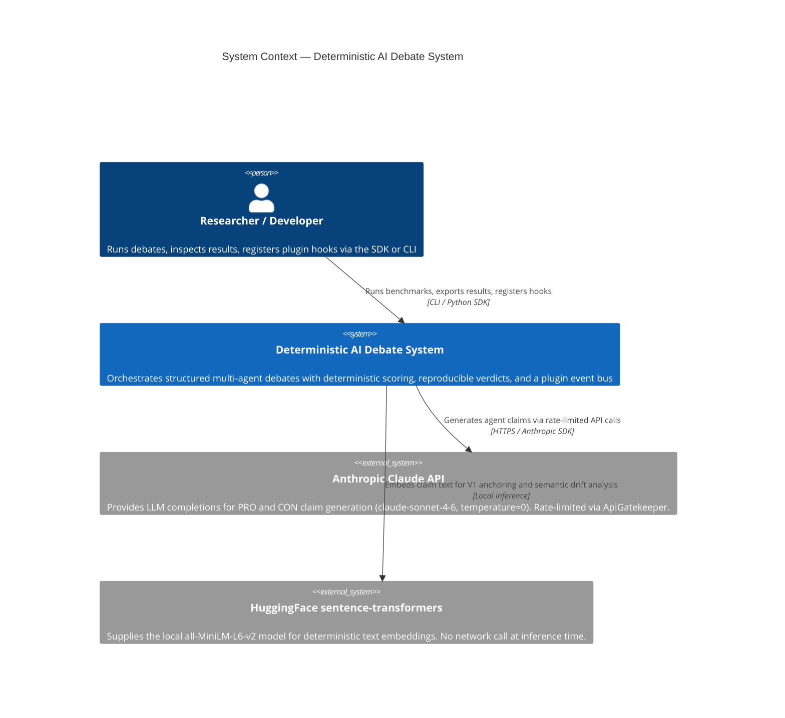
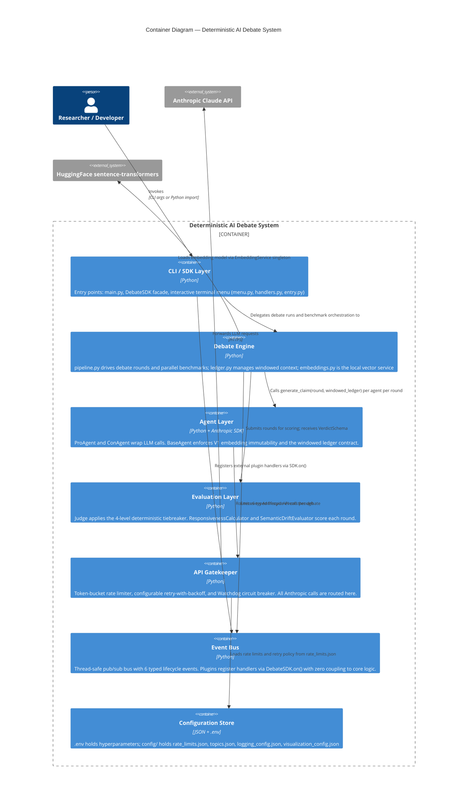
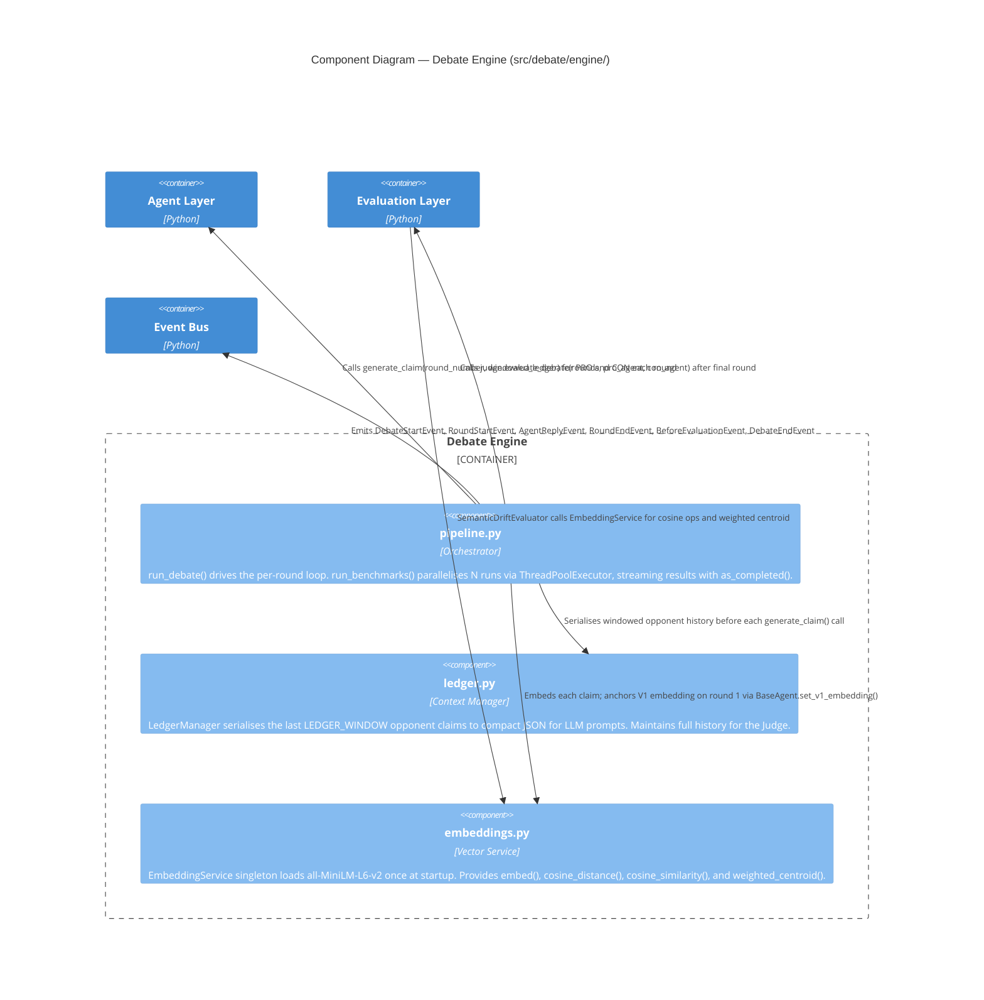

# PLAN: Fragmented OOP Architecture

**Constraint**: No Python file may exceed 150 lines. `main.py` ≤ 20 lines.
**Principle**: Every module has one responsibility. `pipeline.py` orchestrates; nothing else does.

---

## Module Tree with Line Budgets

```
deterministic-ai-debate/
│
├── main.py                                    ≤  20 lines  [HARD LIMIT — CLI shim only]
├── .env                                       (config, not Python)
├── pyproject.toml                             v1.0.0 — Production/Stable
│
├── src/debate/
│   ├── __init__.py                            ~   5 lines  re-exports DebateSDK
│   ├── config.py                              ~  30 lines  pydantic-settings, .env loading
│   ├── sdk.py                                 ~  60 lines  DebateSDK public facade
│   ├── analysis.py                            ~ 140 lines  generate_all() → 4 PNG graphs
│   ├── sensitivity_runner.py                  ~  75 lines  SensitivityRunner, SensitivityConfig
│   │
│   ├── schemas/                               ← IPC contracts (data only, no logic)
│   │   ├── __init__.py                        ~   5 lines
│   │   ├── claim.py                           ~  55 lines  EvidenceSchema, ClaimPayloadSchema
│   │   ├── round.py                           ~  45 lines  LedgerEntry, RoundSchema
│   │   └── verdict.py                         ~  45 lines  VerdictSchema
│   │
│   ├── agents/                                ← LLM wrappers (API calls only)
│   │   ├── __init__.py                        ~   5 lines
│   │   ├── base.py                            ~  85 lines  BaseAgent + permanent V₁ state
│   │   ├── pro.py                             ~  80 lines  ProAgent (Anthropic, cached prompt)
│   │   ├── con.py                             ~  80 lines  ConAgent (Anthropic, cached prompt)
│   │   └── fact_checker.py                    ~  45 lines  FactCheckerSubagent (web search objections)
│   │
│   ├── engine/                                ← orchestration + data management
│   │   ├── __init__.py                        ~   5 lines
│   │   ├── pipeline.py                        ~ 147 lines  MAIN ORCHESTRATOR [≤150 HARD]
│   │   ├── agents_factory.py                  ~  20 lines  make_agents() — extracted from pipeline
│   │   ├── ledger.py                          ~  75 lines  LedgerManager + truncation logic
│   │   └── embeddings.py                      ~  65 lines  EmbeddingService (sentence-transformers)
│   │
│   ├── evaluation/                            ← scoring (pure Python, zero LLM calls)
│   │   ├── __init__.py                        ~   5 lines
│   │   ├── semantic_drift.py                  ~ 100 lines  SemanticDriftEvaluator
│   │   ├── responsiveness.py                  ~  60 lines  ResponsivenessCalculator
│   │   ├── discourse.py                       ~  45 lines  DiscourseChecker (civility policy)
│   │   └── judge.py                           ~ 130 lines  Judge + 4-level tiebreaker hierarchy
│   │
│   ├── gatekeeper/                            ← API rate limiting + circuit breaker
│   │   ├── __init__.py                        ~  10 lines
│   │   ├── config.py                          ~  35 lines  GatekeeperConfig (rate_limits.json)
│   │   ├── gatekeeper.py                      ~  85 lines  ApiGatekeeper (token bucket + retry)
│   │   └── watchdog.py                        ~  60 lines  Watchdog circuit breaker
│   │
│   ├── events/                                ← typed publish-subscribe lifecycle hooks
│   │   ├── __init__.py                        ~   8 lines
│   │   ├── bus.py                             ~  30 lines  EventBus (thread-safe on/emit)
│   │   └── types.py                           ~  50 lines  6 typed lifecycle dataclasses
│   │
│   ├── router/                                ← topic-driven skill selection
│   │   ├── __init__.py                        ~   5 lines
│   │   └── skills.py                          ~  45 lines  TopicRouter keyword → skill mapping
│   │
│   ├── tools/                                 ← external search integration
│   │   ├── __init__.py                        ~   5 lines
│   │   └── search.py                          ~  35 lines  WebSearchTool (DuckDuckGo)
│   │
│   ├── logging/                               ← FIFO rotating file logger
│   │   ├── __init__.py                        ~   5 lines
│   │   └── logger.py                          ~ 120 lines  FifoRotatingHandler, DebateLogger
│   │
│   ├── shared/                                ← stdlib RotatingFileHandler + version
│   │   ├── __init__.py                        ~   5 lines
│   │   ├── logger.py                          ~  50 lines  get_logger() → logging.Logger
│   │   └── version.py                         ~   3 lines  __version__ = "1.0.0"
│   │
│   ├── cli/                                   ← interactive terminal UI
│   │   ├── __init__.py                        ~   5 lines
│   │   ├── entry.py                           ~  20 lines  debate console entry point
│   │   ├── menu.py                            ~ 120 lines  run_loop(), display_menu()
│   │   ├── handlers.py                        ~ 100 lines  handle_*() functions
│   │   └── forecaster.py                      ~  40 lines  cost/token estimator + confirm
│   │
│   └── benchmarks/
│       ├── __init__.py                        ~   5 lines
│       └── reporter.py                        ~  65 lines  BenchmarkReporter → JSON export
│
├── config/
│   ├── rate_limits.json                       requests_per_minute, retries, max_workers
│   ├── topics.json                            debate topics list + default
│   ├── logging_config.json                    max_files, max_lines, log_dir
│   └── visualization_config.json             DPI, format, style, figsize
│
└── tests/                                     247 tests, 0 API calls required
    ├── test_schemas.py                        Phase 1
    ├── test_embeddings.py                     Phase 2a
    ├── test_semantic_drift.py                 Phase 2a
    ├── test_responsiveness.py                 Phase 2a
    ├── test_ledger.py                         Phase 2b
    ├── test_pipeline.py                       Phase 3
    ├── test_logger.py                         Phase 4
    ├── test_gatekeeper.py                     Phase 5
    ├── test_sdk.py                            Phase 6a
    ├── test_cli.py                            Phase 6b
    ├── test_parallel_benchmarks.py            Phase 6c
    ├── test_analysis.py                       Phase 6d
    ├── test_events.py                         Phase 7
    ├── test_progress.py                       Phase 9
    ├── test_router.py                         Bonus
    ├── test_fact_checker.py                   Bonus
    ├── test_search.py                         Bonus
    ├── test_discourse.py                      Bonus
    ├── test_chaos.py                          Phase 10
    ├── test_sensitivity.py                    Phase 10
    ├── test_watchdog.py                       Phase 10
    ├── test_forecaster.py                     Phase 12
    └── test_shared_logger.py                  Phase 13
```

---

## Per-Module Responsibilities

### `main.py` (≤ 20 lines — enforced)

Single responsibility: parse CLI args, delegate entirely to `pipeline`.

```
argparse: --runs N (default 5), --rounds R (default 10), --topic "..."
call: pipeline.run_benchmarks(n=N, rounds=R, topic=topic)
print: winner summary + output file path
```

No business logic. No imports beyond `argparse`, `sys`, `pipeline`.

---

### `src/debate/config.py` (~30 lines)

Single responsibility: load `.env` into a typed `Settings` singleton.

```python
class Settings(BaseSettings):
    RECENCY_DECAY_LAMBDA: float = 0.3
    V1_DISTANCE_THRESHOLD: float = 0.4
    CENTROID_ALIGNMENT_THRESHOLD: float = 0.7
    ANTHROPIC_API_KEY: str
    MAX_ROUNDS: int = 10
    BENCHMARK_RUNS: int = 5
    LEDGER_WINDOW: int = 3
    LLM_MODEL: str = "claude-sonnet-4-6"
    EMBEDDING_MODEL: str = "all-MiniLM-L6-v2"

settings = Settings()
```

All modules import `settings` from here. No module reads `.env` directly.

---

### `schemas/claim.py` (~55 lines)

Single responsibility: IPC schema for a single agent claim.

- `EvidenceSchema`: `source: str`, `quality_score: float [0,1]`, `citation: str`
- `ClaimPayloadSchema`: all fields + `addressed_claim_ids: List[str]` (mandatory)
- UUID4 auto-generation for `claim_id`

---

### `schemas/round.py` (~45 lines)

Single responsibility: schema for a single debate round.

- `LedgerEntry`: wraps `ClaimPayloadSchema` + `embedding: Optional[List[float]]`
- `RoundSchema`: `round_number`, `pro_claim`, `con_claim`, per-agent responsiveness scores

---

### `schemas/verdict.py` (~45 lines)

Single responsibility: schema for the final judgment.

- `VerdictSchema`: `winner: Literal["PRO","CON"]` (never null), `tiebreaker_used`, full scoring breakdown per agent

---

### `agents/base.py` (~85 lines)

Single responsibility: shared agent state with **permanent V₁ isolation**.

```
BaseAgent(ABC):
    agent_id: str
    stance: Literal["PRO", "CON"]
    v1_embedding: Optional[List[float]] = None   ← NEVER truncated, immutable after set
    ledger: List[LedgerEntry] = []

    set_v1_embedding(embedding) → None
        raises RuntimeError if called twice

    get_windowed_ledger(window: int) → List[LedgerEntry]
        returns ledger[-window:]  ← for LLM context only

    add_to_ledger(entry: LedgerEntry) → None

    @abstractmethod
    generate_claim(round_number, opponent_windowed_ledger) → ClaimPayloadSchema
```

**Key invariant**: `v1_embedding` is not a ledger entry. It is agent state. The windowed ledger returned for LLM prompting never includes V₁.

---

### `agents/pro.py` / `agents/con.py` (~80 lines each)

Single responsibility: LLM call + response parsing for one stance.

```
ProAgent(BaseAgent):
    _system_prompt: str          ← cached, built once at init
    generate_claim(...):
        build prompt from windowed_ledger (compact JSON)
        call Anthropic API (temperature=0, prompt caching on system_prompt)
        parse JSON response → ClaimPayloadSchema
        validate addressed_claim_ids exist in opponent ledger
```

ConAgent is structurally identical with opposite stance and persona.

---

### `engine/ledger.py` (~75 lines)

Single responsibility: ledger append/query with truncation for LLM context.

```
LedgerManager:
    entries: List[LedgerEntry]
    append(entry) → None
    get_window(n: int) → List[LedgerEntry]   ← last n entries for LLM context
    get_all() → List[LedgerEntry]            ← for judge scoring (full history)
    serialize_for_llm(entries) → str         ← compact JSON, not prose
    get_claim_ids() → Set[str]               ← for responsiveness validation
```

---

### `engine/embeddings.py` (~65 lines)

Single responsibility: local, deterministic text embeddings.

```
EmbeddingService (singleton):
    _model: SentenceTransformer("all-MiniLM-L6-v2")

    embed(text: str) → List[float]
    cosine_distance(a, b: List[float]) → float
    cosine_similarity(a, b: List[float]) → float
    weighted_centroid(embeddings, weights) → List[float]
```

Singleton pattern prevents re-loading the model on every call. No network calls.

---

### `evaluation/responsiveness.py` (~60 lines)

Single responsibility: pure Python Responsiveness Score.

```
ResponsivenessCalculator:
    calculate(claim: ClaimPayloadSchema, opponent_ledger: LedgerManager) → float
        valid = set(claim.addressed_claim_ids) & opponent_ledger.get_claim_ids()
        return len(valid) / max(len(opponent_ledger.entries), 1)
```

No LLM. No embeddings. O(n) set intersection only.

---

### `evaluation/semantic_drift.py` (~100 lines)

Single responsibility: detect and quantify semantic drift from V₁.

```
DriftResult(BaseModel):
    v1_distance: float
    centroid_alignment: float
    drift_penalty: float

SemanticDriftEvaluator:
    __init__(embeddings: EmbeddingService, settings: Settings)
    evaluate(agent: BaseAgent, current_embedding: List[float],
             opponent_embeddings: List[List[float]]) → DriftResult
        v1_distance = embeddings.cosine_distance(current_embedding, agent.v1_embedding)
        centroid = embeddings.weighted_centroid(opponent_embeddings, decay_weights)
        centroid_sim = embeddings.cosine_similarity(current_embedding, centroid)
        compute and return penalty
```

Reads `agent.v1_embedding` directly from agent state — never from the ledger window.

---

### `evaluation/judge.py` (~130 lines)

Single responsibility: produce a singular, deterministic `VerdictSchema`.

```
RoundScores(BaseModel):
    evidence_quality: float
    drift_penalty: float
    responsiveness: float

Judge:
    score_round(round: RoundSchema, pro_agent, con_agent) → Tuple[RoundScores, RoundScores]
    evaluate_debate(rounds, pro_agent, con_agent) → VerdictSchema
        aggregate RoundScores → total_score per agent
        if |pro_total - con_total| < TIE_EPSILON:
            return _resolve_tiebreaker(...)
        return VerdictSchema(winner=argmax)

    _resolve_tiebreaker(pro_agg, con_agg, pro_agent, con_agent, debate_id) → VerdictSchema
        Level 1: evidence_quality
        Level 2: v1_distance (lower = better)
        Level 3: responsiveness
        Level 4: random.Random(seed=hash).choice(["PRO","CON"])
```

---

### `engine/pipeline.py` (~145 lines — LINE BUDGET ENFORCED)

Single responsibility: orchestrate one debate run and N benchmark runs.

#### Annotated Line Budget

```
Lines   1– 12  imports (config, agents, engine, evaluation, benchmarks, dataclasses)
Lines  13– 30  DebateResult dataclass definition
Lines  31– 35  run_debate() signature + agent/judge init
Lines  36– 40  timing setup, empty round list
Lines  41–100  for round_num in range(1, max_rounds+1):        [10 rounds × ~6 lines]
                 pro_claim  = pro_agent.generate_claim(...)     [2 lines]
                 con_claim  = con_agent.generate_claim(...)     [2 lines]
                 embed + set V₁ if round_num == 1              [5 lines]
                 responsiveness calc (pro + con)                [4 lines]
                 drift eval (pro + con)                         [4 lines]
                 build RoundSchema, append to rounds list       [4 lines]
                 record round latency                           [1 line]
Lines 101–120  judge.evaluate_debate(rounds, pro, con) → verdict
Lines 121–135  build DebateResult with timing/token/cost data
Lines 136–145  run_benchmarks(n, rounds, topic) → List[DebateResult]
                 loop n times, call run_debate(), collect
                 call reporter.export(results)
                 return results
```

**Safety margin: 5 lines. Absolute maximum: 150.**

---

## ASCII Data Flow

```
main.py  ──────────────────────────────────────────────────────────
  │  (CLI args only)                                               │
  ▼                                                                │
pipeline.run_benchmarks(n=5)                                       │
  │                                                                │
  ├─► for each run: run_debate()                                   │
  │       │                                                        │
  │       ├─► ProAgent.generate_claim(round, windowed_ledger)      │
  │       │         └── Anthropic API  temperature=0              │
  │       │             cached system prompt prefix               │
  │       │                                                        │
  │       ├─► ConAgent.generate_claim(round, windowed_ledger)      │
  │       │         └── Anthropic API  temperature=0              │
  │       │                                                        │
  │       ├─► EmbeddingService.embed()                            │
  │       │         └── round==1: BaseAgent.set_v1_embedding()    │
  │       │             (immutable after this call)               │
  │       │                                                        │
  │       ├─► ResponsivenessCalculator.calculate()  [pure Python] │
  │       │                                                        │
  │       ├─► SemanticDriftEvaluator.evaluate()                   │
  │       │         └── reads agent.v1_embedding directly         │
  │       │             (NOT from ledger window)                  │
  │       │                                                        │
  │       ├─► LedgerManager.append()                              │
  │       │         rounds>3: window truncated for LLM context    │
  │       │         V₁ remains in agent state, untouched          │
  │       │                                                        │
  │       └─► Judge.evaluate_debate()                             │
  │                 └── _resolve_tiebreaker() if needed           │
  │                     [pure Python, no LLM]                     │
  │                     tiebreaker: evidence→contradiction         │
  │                                →responsiveness→prng           │
  │                                                                │
  └─► BenchmarkReporter.export() ──► debate_systems_research.json │
```

---

## Dependency Graph (acyclic — verified)

```
config
  └── (imported by all modules — no reverse deps)

schemas/claim  ←── schemas/round  ←── schemas/verdict
     ↑                  ↑
  agents/base        evaluation/*
     ↑
  agents/pro, agents/con

engine/embeddings  ←── evaluation/semantic_drift
engine/ledger      ←── agents/base, engine/pipeline
evaluation/responsiveness  ←── evaluation/judge
evaluation/semantic_drift  ←── evaluation/judge
evaluation/judge   ←── engine/pipeline
agents/*           ←── engine/pipeline
benchmarks/reporter ←── engine/pipeline
```

**No circular imports.** `config` and `schemas` are pure leaves.

---

## C4 Model Architecture

The following diagrams use the [C4 model](https://c4model.com/) to describe
the system at three levels of abstraction, rendered via Mermaid.

### Level 1 — System Context

Who uses the system and which external systems does it depend on.



---

### Level 2 — Container Diagram

The logical containers (deployable/runnable units) that make up the system.



---

### Level 3 — Component Diagram: Debate Engine

The internal components of the `engine/` container.



---

## CI/CD: GitHub Actions Automation

GitHub Actions enforces the project's quality gates on every `push` and
`pull_request` to `master` / `main`. The workflow mirrors local development
exactly — `uv` is the single task runner throughout:

```
ubuntu-latest
  ├── actions/checkout@v4
  ├── astral-sh/setup-uv@v5       (install uv)
  ├── uv sync                     (install all deps from uv.lock)
  ├── uv run ruff check .         (zero-error lint gate)
  └── uv run pytest               (all tests must pass)
```

No direct `pip` or `python -m` calls. The workflow file lives at
`.github/workflows/ci.yml` and is the canonical source for what "passing"
means in this project.

---

## Key Design Decisions

| Decision | Rationale |
|---|---|
| `sentence-transformers` (local) | Deterministic; no API dependency; free; no latency variance |
| `temperature=0` on all LLM calls | Eliminates sampling non-determinism entirely |
| V₁ in `BaseAgent` state, not ledger | Survives truncation; never accidentally included in LLM prompt |
| Compact JSON for truncated context | 3–5× token reduction vs. prose history passthrough |
| Seeded PRNG with `debate_id` hash | Coin-flip tiebreaker is reproducible for identical debates |
| `pipeline.py` only orchestrates | All logic is independently testable; `main.py` is a pure shim |
| One module per concern | Files stay under 150 lines without forced truncation |
| `pydantic-settings` for config | `.env` is the single source of truth; no hardcoded hyperparameters |

---

## Architectural Decision Records (ADRs)

ADRs capture the significant design choices made in this project, the context
that motivated them, and the trade-offs accepted. Each record is immutable once
accepted; superseded ADRs are marked accordingly.

---

### ADR-001: ThreadPoolExecutor for Parallel Benchmark Orchestration

| Field | Value |
|---|---|
| **Status** | Accepted |
| **Date** | 2026-05-17 |
| **Deciders** | System Architect |
| **Affected modules** | `src/debate/engine/pipeline.py`, `src/debate/gatekeeper/config.py` |

#### Context

Benchmarks require running N independent debate sessions (default N = 5). Each
session consists of multiple sequential Anthropic API calls — one per agent per
round. These calls are strictly **I/O-bound**: the Python thread blocks while
waiting for a network response, then resumes to parse a few hundred bytes of
JSON. The CPU is idle for the vast majority of each call's duration.

Two primary concurrency models were available:

- `concurrent.futures.ThreadPoolExecutor` — OS threads with Python's GIL
- `asyncio` — cooperative coroutines with a single-threaded event loop

#### Decision

Use `ThreadPoolExecutor` with a configurable `max_workers` value loaded from
`config/rate_limits.json`. Each debate session runs in its own thread. Results
are collected via `concurrent.futures.as_completed()` to enable streaming
progress reporting.

#### Rationale

1. **GIL irrelevance for I/O-bound work.** Python's Global Interpreter Lock is
   released during I/O operations (network reads/writes inside the Anthropic SDK).
   Threads genuinely run concurrently while waiting for API responses. CPU-bound
   parallelism (where the GIL matters) does not appear in this workload.

2. **Zero refactoring cost.** The Anthropic SDK, `ApiGatekeeper`, `ProAgent`,
   `ConAgent`, and `Judge` are all synchronous. `ThreadPoolExecutor` wraps them
   without any API changes. Adopting `asyncio` would require propagating
   `async/await` through every layer of the call stack.

3. **Single concurrency model.** `ApiGatekeeper` already uses `threading.Lock`
   for its token bucket. Introducing `asyncio` would create a second concurrency
   model in the same process, requiring careful boundary management between the
   sync and async worlds (e.g., `asyncio.run_in_executor` bridges).

4. **`as_completed()` for progress streaming.** `concurrent.futures.as_completed()`
   integrates naturally with `rich.progress`, yielding futures as they resolve so
   the progress bar advances in real time.

5. **`max_workers` is config-driven.** Thread count is read from
   `rate_limits.json` at runtime, allowing operators to tune concurrency to match
   their API rate limit tier without modifying any Python file.

#### Consequences

**Positive:**
- Parallel benchmarks complete in ≈ 1/N of sequential time for I/O-bound sessions.
- No `async/await` syntax in any module; the codebase stays readable for
  researchers unfamiliar with asynchronous Python.
- Thread safety is fully encapsulated inside `ApiGatekeeper`; agents and the
  pipeline do not reason about concurrency directly.

**Negative / Trade-offs:**
- Each thread holds an OS stack (~1 MB by default); N = 10+ sessions would
  consume meaningful memory. In practice, N ≤ 5–10 is the expected use case.
- The GIL still serialises pure-Python CPU work (JSON parsing, Pydantic
  validation) between threads, causing minor serialisation overhead that would
  not exist with `asyncio`.
- Thread pool exhaustion is not self-healing; if `max_workers` is set too high
  for the API tier, the `ApiGatekeeper` rate limiter (not the pool) becomes the
  bottleneck.

#### Alternatives Considered

| Alternative | Reason Rejected |
|---|---|
| `asyncio` + `anthropic.AsyncAnthropic` | Requires full async refactor of agents, gatekeeper, and pipeline. No runtime benefit for this I/O-bound workload pattern. |
| `multiprocessing.Pool` | Process-per-debate has prohibitive memory overhead (each process reloads the sentence-transformer model, ~100 MB). |
| Sequential execution (no parallelism) | Unacceptable latency: 5 × 10-round debates at ~2 s/round = ~100 s sequentially vs. ~20 s in parallel. |

---

### ADR-002: EventBus / Hooks Architecture for the Plugin System

| Field | Value |
|---|---|
| **Status** | Accepted |
| **Date** | 2026-05-17 |
| **Deciders** | System Architect |
| **Affected modules** | `src/debate/events/bus.py`, `src/debate/events/types.py`, `src/debate/engine/pipeline.py`, `src/debate/sdk.py` |

#### Context

Research users need to observe debate lifecycle events (session start, each
round's claims, the final verdict, etc.) to build custom logging, real-time
dashboards, data exporters, or evaluation plugins. The core orchestration logic
in `pipeline.py` must remain unmodified when new observers are added —
modifying `pipeline.py` per consumer would violate the Open-Closed Principle
and make the codebase fragile under academic iteration.

#### Decision

Implement a lightweight, thread-safe `EventBus` with six explicitly typed
lifecycle events. External code registers `Callable` handlers via
`DebateSDK.on(event_name, handler)`. `pipeline.run_debate()` emits events at
fixed hook points; it has no knowledge of registered consumers.

The six lifecycle events and their emission points are:

| Event | Emitted when |
|---|---|
| `DebateStartEvent` | Before round 1 begins |
| `RoundStartEvent` | At the start of each round |
| `AgentReplyEvent` | After each agent generates a claim |
| `RoundEndEvent` | After both agents have replied and round metrics are computed |
| `BeforeEvaluationEvent` | After the final round, before the Judge runs |
| `DebateEndEvent` | After the `VerdictSchema` is produced |

#### Rationale

1. **Open-Closed Principle.** `pipeline.py` is open for extension (new handlers
   can observe any event) and closed for modification (no pipeline code changes
   when a plugin is added or removed). This is the central architectural
   invariant of the plugin system.

2. **Zero coupling.** Handlers receive typed dataclasses (`RoundEndEvent`,
   `DebateEndEvent`, etc.) that carry only public data. Plugins import from
   `debate.events` — never from internal engine modules. The dependency arrow
   points inward only.

3. **Thread safety by design.** `EventBus.on()` acquires a `threading.Lock`
   during handler registration. `EventBus.emit()` takes a snapshot of the
   handler list before iterating, so concurrent `run_debate()` calls cannot
   observe a partially updated handler list.

4. **Explicit contract surface.** The six named events are the documented,
   versioned plugin API. Each event dataclass is a `@dataclass` with typed
   fields — consumers get IDE autocompletion and static analysis support.
   The total surface is small enough to be understood in a single reading.

5. **Proportionality.** The implementation fits within the 150-line/file
   constraint (`bus.py` < 20 lines, `types.py` < 50 lines). A heavy plugin
   framework (e.g., `pluggy`) would add an external dependency for a
   problem this bounded in scope.

6. **Fail-loud semantics.** Handler exceptions propagate out of `emit()` by
   design. Silent swallowing of plugin errors would mask research bugs; loudness
   is the correct default for an academic system where correctness is paramount.

#### Consequences

**Positive:**
- Adding a plugin requires zero changes to any core module — only a call to
  `sdk.on(event, handler)` before `run_single()` or `run_benchmark()`.
- Typed event dataclasses make plugin code self-documenting and refactor-safe.
- The bus is reusable across both single-run and benchmark modes with no
  additional wiring.

**Negative / Trade-offs:**
- Handler registration order determines invocation order within an event;
  there is no priority mechanism. This is acceptable because handlers are
  expected to be independent observers, not ordered transformers.
- No event versioning scheme is defined. If a typed event dataclass gains or
  loses a field in a future release, all registered handlers that reference
  that field must be updated. A versioned schema registry would mitigate this
  at the cost of significant added complexity.
- A handler that raises an unhandled exception aborts subsequent handlers for
  that event emission. Plugin authors are responsible for their own error
  boundaries (e.g., wrapping handler bodies in `try/except`).

#### Alternatives Considered

| Alternative | Reason Rejected |
|---|---|
| `pluggy` (pytest's plugin framework) | Adds an external dependency; requires `hookspec` marker decorators; designed for CLI tool plugins, not for in-process research instrumentation. |
| Abstract base class / subclass hooks | Every new hook point requires modifying `pipeline.py` (adding an abstract method call), directly violating OCP. Inheritance also prevents multiple independent plugins. |
| Direct callback injection into `run_debate()` | Passing callbacks as function parameters couples the pipeline signature to every possible observer, producing an unmanageable argument list as the plugin surface grows. |
| `multiprocessing` message queue | Introduces IPC serialisation overhead and prevents handlers from sharing in-process state with the main debate run — unnecessary complexity for an in-process instrumentation use case. |

---

## CLAUDE.md as Prompt Engineering and Architectural Constraint Strategy

This project was developed using Claude Code (Anthropic's AI coding CLI) with a `CLAUDE.md` file at the repository root serving as the **binding contract** between the human architect and the AI coding agent. This section documents how the `CLAUDE.md` contract functioned as the primary prompt engineering and architectural constraint strategy for the project.

### What is CLAUDE.md?

`CLAUDE.md` is a session-persistent instruction file that Claude Code loads at the start of every conversation. Unlike ad-hoc prompting — where rules must be restated in each session — `CLAUDE.md` provides **versioned, project-scoped rules** that the AI agent honours across all tool calls, file edits, and implementation decisions without reminders. It is the AI-native equivalent of a coding standards document, except it is **enforced at the model level** rather than by a lint tool.

---

### Karpathy's Rules: Explicit Invariants, Fail-Loud

The constraints in `CLAUDE.md` were inspired by Andrej Karpathy's philosophy of making invariants **explicit, checked, and non-negotiable**. The key principle: every property that matters for correctness must be enforced structurally — not documented and hoped for, but made impossible to violate silently.

| Invariant | Enforcement Mechanism | Consequence of Violation |
|---|---|---|
| `v1_embedding` is immutable after Round 1 | `set_v1_embedding()` raises `RuntimeError` on second call | Silent positional drift — all drift metrics become invalid; benchmark is scientifically worthless |
| No Python file > 150 lines | Grading automation + `find` gate in every phase | Forces Single Responsibility Principle; prevents "god files" that accumulate undocumented logic |
| All Anthropic calls through `ApiGatekeeper` | No `messages.create()` permitted in `agents/` | Silent rate-limit failures, uncontrolled cost, and Watchdog bypass |
| `temperature=0` on all LLM calls | Enforced in agent constructors via Anthropic SDK parameter | Non-deterministic benchmark output — different winners on identical inputs |
| `VerdictSchema.winner` is never null | 4-level deterministic tiebreaker terminates in `prng` | `None` verdicts in benchmark JSON; aggregates crash on `argmax(None)` |
| No hardcoded hyperparameters | `.env` + `pydantic-settings`; startup error on misconfiguration | Reproducibility broken — a different lab cannot reproduce results without source code archaeology |

The `CLAUDE.md` file encoded these invariants as **literal rules the AI agent could not violate**. When the agent proposed an edit that would breach one — for example, calling `set_v1_embedding()` twice during a retry path — the rule in `CLAUDE.md` caused the model to self-correct before submitting the edit.

---

### Agentic Extensions: TDD-First, Phase Gates, Module Fragmentation

Beyond Karpathy's invariant rules, `CLAUDE.md` encoded **agentic workflow extensions** — meta-rules governing *how* the AI agent was permitted to approach implementation tasks. These prevented the most common failure modes of AI-assisted coding:

**1. TDD-First Mandate**
No implementation file could be written until the corresponding test file existed and the tests were designed to fail. This prevented the AI from taking shortcuts that would produce passing-but-wrong implementations — a particularly acute risk when the AI is both writing the tests and the code.

**2. Phase Gates**
After each phase, the agent was required to run:
```bash
uv run ruff check .          # zero errors before proceeding
uv run pytest -v             # full suite green before proceeding
find src tests main.py -name "*.py" | xargs wc -l   # no file ≥ 150 lines
```
This transformed the AI's development loop into a systematic, verifiable workflow.

**3. Module Fragmentation Rules**
The 150-line limit was encoded with a specific consequence: when a module approached the limit, the agent was required to split it along functional seams rather than compress logic. This rule produced:
- `agents_factory.py` — extracted from `pipeline.py` when it reached 148 lines
- `discourse.py` — extracted from `judge.py` to isolate the civility policy
- `shared/logger.py` — separated from `logging/logger.py` for stdlib vs. custom concerns

**4. Dependency Directionality**
The `CLAUDE.md` described the acyclic dependency graph explicitly: `config` and `schemas` are leaves; `pipeline` is the only orchestrator; no evaluation module may import from `engine`. The agent could not introduce an import that would create a cycle — the rule was checked as a `grep` command the agent was required to run.

---

### How CLAUDE.md Prevented Silent Failures and Deterministic Routing Issues

The most critical function of the `CLAUDE.md` contract was preventing **silent failures** — conditions where the system produces a result that appears correct but is scientifically invalid:

**Silent Semantic Drift**: Without the `v1_embedding` immutability rule, an agent under iterative revision pressure might silently overwrite the V₁ anchor during a JSON-retry path. The `RuntimeError` made this failure **loud and immediate** — catchable in the test suite, not discoverable only by examining benchmark plots.

**Deterministic Routing Bypass**: Without the "all Anthropic calls through `ApiGatekeeper`" rule, a future developer (or the AI itself) might introduce a direct `messages.create()` call inside a helper function, bypassing rate limiting, backoff, and the Watchdog circuit breaker. The gatekeeper rule made routing **structurally impossible to accidentally bypass** — verified by `grep -rn "messages.create" src/debate/agents/`.

**Context Explosion**: Without the explicit `LEDGER_WINDOW` truncation protocol, the AI would naturally expand context passed to LLMs in service of "correctness," silently blowing up benchmark costs. The truncation rule made cost overruns **structurally impossible** — the ledger window is fixed at startup, not negotiated per-round.

**Hardcoded Hyperparameters**: Without the "no hardcoded values in Python" rule, the AI would embed values like `0.3` or `0.4` as literals during rapid prototyping. The `pydantic-settings` mandate made misconfiguration **a startup-time error with a clear message**, not a silent wrong answer buried in run 4 of 5 benchmarks.

The `CLAUDE.md` contract was, in essence, the difference between a **research-reproducible system** and an **impressively-functioning but non-reproducible prototype**. Every phase gate, every `RuntimeError`, every config-driven JSON file, and every forced module split traces back to a rule in that contract.
